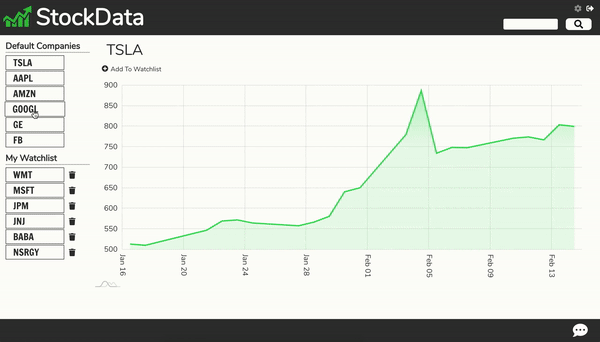

## Directions
### To Start Client Side:
* cd client
* npm run start

### To Start Server Side:
* npm run start

## Built With

* [React](https://reactjs.org/) - Frontend
* [Express](https://expressjs.com/) - Backend
* [MarketStack](https://marketstack.com/) - API
* [am4core](https://www.amcharts.com/docs/v4/) - Chart
* [JsDoc](https://jsdoc.app/) - Documentation
* [JWT](https://jwt.io/) - Authentication
* [Socket.io](https://socket.io/) - Chat App

## View Live Site
[Visit Here](https://fullstack-stockmarket-app.herokuapp.com/)

# Demo

